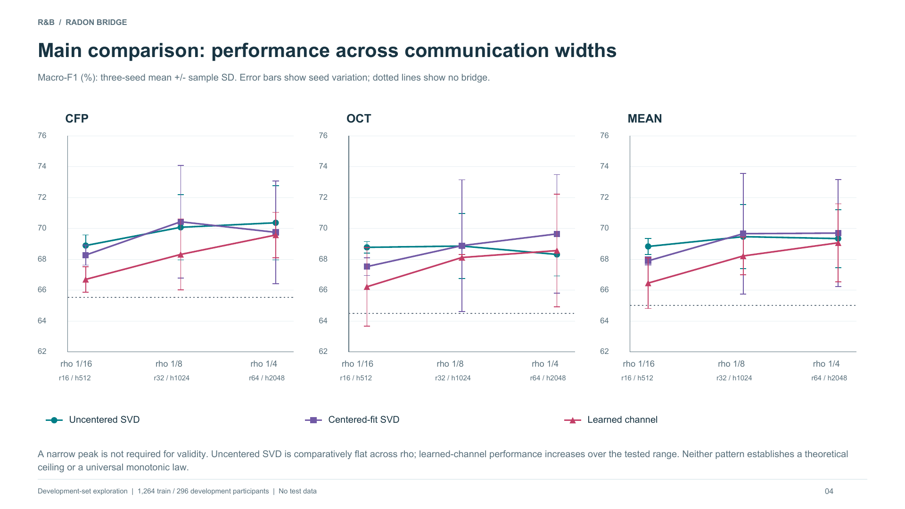

# Radon_Bridge — Radon Bridge（R&B）

两条完整ResNet18分别处理CFP与OCT，保留各自主干、任务头、CE损失和预测。先独立监督训练至开发集平台期，再恢复各自最佳检查点，通过MHD V4的中间节点接入线性R&B，进行全参数联合训练，BN正常更新。

三项目共用[工作目录约定](workspace/README.zh-CN.md)。

## 当前工作入口：2026_09_09_10_30_34（Ibex准备）

仓库及项目目录统一为`Radon_Bridge`，新Python包为`radon_bridge`。新时间戳的[目录、依赖、兼容与Slurm说明](experiments/2026_09_09_10_30_34/README.zh-CN.md)是后续扩展入口。Ibex本轮代码位于`/ibex/project/c2377/souray/home/mengh/Radon_Bridge/2026_09_09_10_30_34`；输出位于对应`data/mengh/Radon_Bridge/runs/2026_09_09_10_30_34`。全量影像迁移在继续，GPU申请暂停，新实验协议尚未锁定。

旧`radonbridge`导入及ws02旧路径保留兼容，历史结果不改写。依赖固定为核验时最新MHD_Project提交，继续使用其与旧版一致的V4接口；不声称已迁移V5。

## 当前报告：开发与test完整匹配（2026-09-08）

[中文结论与阅读导航](reports/2026_09_08_matched/README.zh-CN.md) · [完整匹配主报告](reports/2026_09_08_matched/RB_Matched_Development_Test_Guided_Report.pdf) · [804项逐条配对附表](reports/2026_09_08_matched/RB_All_804_Matched_Results.pdf) · [全量配对CSV](reports/2026_09_08_matched/all_804_matched_results.csv) · [扩展前核查](reports/2026_09_08_expansion_audit/README.zh-CN.md)

804条研究引用、777个去重模型视图的development/test逐项对应；121项主要比较和54个配对扰动模型均保留两集合结果。每幅图附中文读法、坐标/单位、比较方向及结论限制。旧47页整合PDF已由本版替换；原实验记录、预测、源图和统计证据不变。

当前统一研究已评价290名test参与者。所有模型由296名开发参与者选中，不在test重新选优；该test的既往LOOK使用史继续披露，不称外部独立临床验证。本次更新仅做既有结果整理与训练集只读审计，新增训练、开发/test推理和bootstrap均为0。后续扩展另立协议，不按本批test重新调参。

## 历史阶段：三组配对实验（2026-09-05）

[完整结果与说明](reports/2026_09_05_three_group_final/README.zh-CN.md) · [23页导师汇报PDF](reports/2026_09_05_three_group_final/Radon_Bridge_Three_Group_Advisor_Report.pdf) · [129项结果CSV](reports/2026_09_05_three_group_final/results.csv) · [最终验收](reports/2026_09_05_three_group_final/FINAL_ACCEPTANCE.json)

非中心化SVD、中心化拟合SVD、可学习原生通道编解码三组各36项，另21项无桥/原可学习CM/固定随机QR参照，共129项，全部达到预设平台期。三种子3416–3418、ρ=1/16/1/8/1/4，主组包含标准Radon、自身处理、空间打乱和等宽线性重采样。报告保留负结果、逐种子结果、配对区间与实际成本，不把开发集结果当作独立测试证据。

## 基础实现与历史三组协议

- stage3、M32、S64；第二阶段backbone LR=6e−5、head/bridge LR=1e−4，batch16。AdamW WD0.01，各分支与桥分别裁剪5。
- 至少8轮；连续6轮无超过0.001的实质改善判平台；3轮停滞LR×0.3；最多60轮仅保护上限。按两任务macro-F1平均值选择共同检查点。
- 默认`learned_projected`：Radon后展平C×M通道，再进行可学习压缩/恢复。与新增`learned_channel`的Radon前逐点C→r编码、反投影后r→C恢复不同。
- 固定通道版本支持非中心化SVD、中心化拟合SVD和随机QR；基为持久化buffer。中心化仅改变基拟合统计量，运行时不减/加均值。固定版本桥内只有中间卷积可学习。
- 几何使用固定EEM、Householder Radon与普通直接反投影；中间kernel=3线性卷积，无偏置、零初始化。桥内无激活、门控或BN，残差写回原MHD Node ID。
- M/ρ支持逐来源配置；当前快速实验两来源使用相同值。固定通道与可学习原生通道版本ρ表示维数比例，r=max(1,floor(ρC))、h=rM；不是能量阈值。

生效要求及历史覆盖关系见[REQUIREMENTS.md](REQUIREMENTS.md)，配对与展示标准见[报告约定](experiments/2026_09_05_13_32_31/REPORT_CONTRACT.zh-CN.md)。训练源码归档于时间戳分支`2026_09_05_13_32_31`（35675f4）；之后的结果文档提交不改变训练实现。

## 数据与运行边界

正式代码在GitHub，训练机器为`ws02`。当前缓存为1264训练、296开发验证、290测试；开发集参与过任务/配置筛选。训练入口禁止读取测试集；独立锁定评价入口已完成本轮统一test。早期报告仍按其当时的数据角色解释。数据、模型与参与者级预测保留于远端`/data/mengh/RadonBridge`，GitHub仅同步代码、协议和不含参与者标识的汇总。

GPU时长不限但持续记账；每卡本项目≤10 GiB，不影响其他LOOK任务。未平台、OOM或失败均不能算完整实验，不能自动改变batch或收敛标准。代码和诊断验收与医学有效性结论分别解释。
