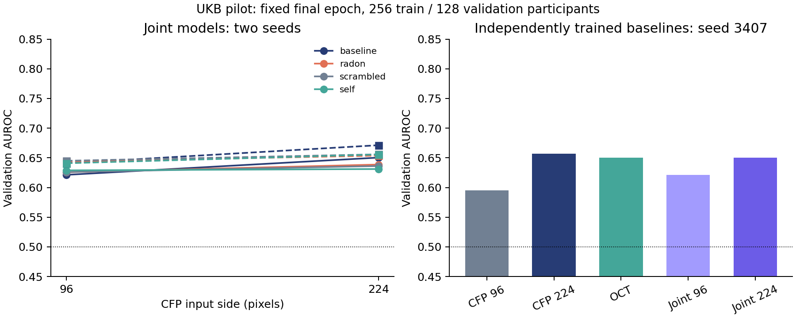

# 实验 003：CFP 分辨率与独立单模态基线

> **状态更正（2026-09-04）：** 其中共享头实验不符合用户要求的“独立预测器 + 中间特征桥接”；原结果仅保留作历史探索，不构成该方案的有效性验证。单模态/晚期平均也未按 macro-F1 选优。详见说明书审计。

完成 7 次独立运行、19 个训练续跑臂；单 GPU 累计运行 11.07 分钟（含
评估与 I/O），峰值进程显存 2064 MiB，约 2.02 GiB。只用了 GPU 1。
代码版本为 `run/003-source`，完整提交见 aggregate.json；测试集未使用。

结论：保留 224 CFP 作为下一阶段默认候选；当前 R&B 未表现出可靠的额外
收益。提高分辨率改善了 AUROC 的点估计，但样本不确定性很大；过拟合和
概率质量仍是更直接的问题。没有据此宣称统计显著或临床有效。

## 固定最后一轮：主要探索口径

同一批 256 训练 / 128 验证参与者，OCT 不变，两个预先固定的种子。

| CFP / seed | 联合基线 | R&B | 打乱几何 | 仅模态内滤波 | R&B - 基线 |
|---|---:|---:|---:|---:|---:|
| 96 / 3407 | 0.6213 | 0.6257 | 0.6260 | 0.6289 | +0.0044 |
| 96 / 3408 | 0.6409 | 0.6438 | 0.6450 | 0.6409 | +0.0029 |
| 224 / 3407 | 0.6504 | 0.6387 | 0.6362 | 0.6311 | -0.0117 |
| 224 / 3408 | 0.6713 | 0.6537 | 0.6559 | 0.6556 | -0.0176 |

上表均为验证 AUROC。96 下的小幅增益没有超过打乱几何；224 下两个种子
均下降。所有预先计算的 R&B 与各对照差值的参与者 bootstrap 95% 区间
均跨零。区间未做多重比较校正；同一验证集还参与了暖启动选优，不能当作
独立确认性检验。两个种子只用于方向检查，不能充分刻画训练方差。

| 独立训练基线，seed 3407 | 固定末轮 AUROC | 固定末轮交叉熵 | 选优 AUROC |
|---|---:|---:|---:|
| CFP 96 | 0.5955 | 0.7130 | 0.5979 |
| CFP 224 | 0.6567 | 0.8464 | 0.6575 |
| OCT | 0.6501 | 0.6550 | 0.6536 |

CFP 224 相比 96 的固定末轮差值 +0.0613，探索性 95% 区间
[-0.0459, 0.1596]。联合基线的分辨率差值在两个种子为 +0.0291、+0.0304，
区间同样跨零。方向值得后续验证，但证据不足以确定分辨率效果。
CFP 224 的交叉熵反而上升，说明排序改善没有伴随概率质量改善。记录
AUROC 的同时必须保留交叉熵和 Brier，不能只挑有利指标。

## 验证选优口径与工程检查

续跑检查点候选包含共同的 epoch 0，防止强行从退化后的模型里挑一个。
3407 的两种联合输入、3408 的 224 联合输入，四臂都选回共同起点。
3408 的 96 输入只有 R&B 与 scrambled 选到了更高续跑 AUROC，且后者更高。
具体选中轮数及所有指标见 aggregate.json。

本轮启用确定性 CUDA 算法；没有通过重复完全相同的训练来宣称跨环境
逐位复现。原始图像到 96 的预处理逐像素核对、MHD 前后向与数值检查、
运行锁验证记录在 VALIDATION.md。224 从原图重建，绝非放大旧 96 缓存。

## 下一步决策

1. 先用已有独立模型的固定预测做等权融合，不追加 GPU 训练，判断可利用
   的模态互补性；另立实验 004，明确为看到本轮结果后的探索性跟进。
2. 下一阶段优先增加训练样本、控制过拟合并改善强基线；不能因本轮阴性
   就否定 R&B，也不能靠继续调参和重复查看这 128 人来制造阳性。
3. 只有普通融合基线足够稳定后，才扩大几何机制对照：普通可学习投影、
   低秩通信、配对打乱等。疾病/年龄/视功能任务仍保持开放，不能按 R&B
   最大增益反向选择终点。

